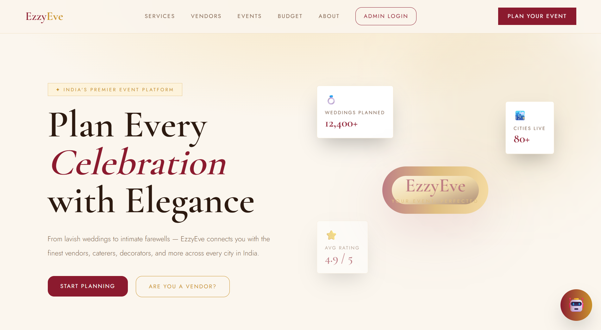
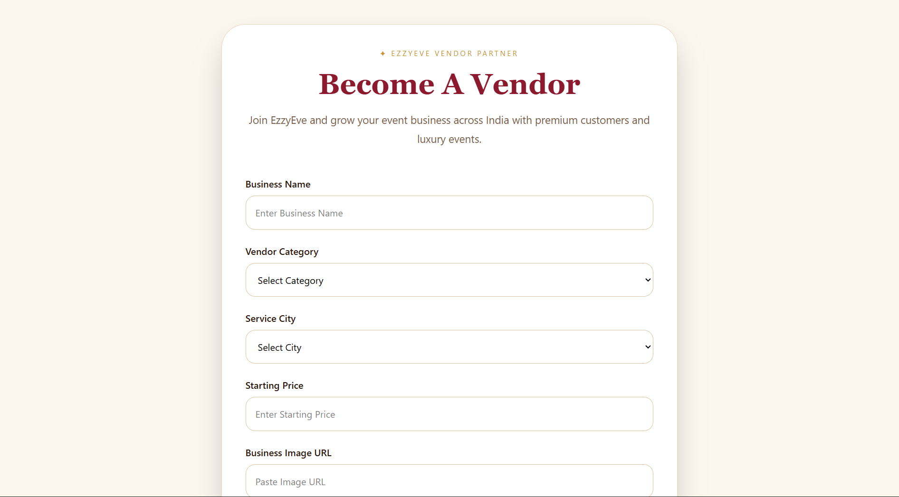
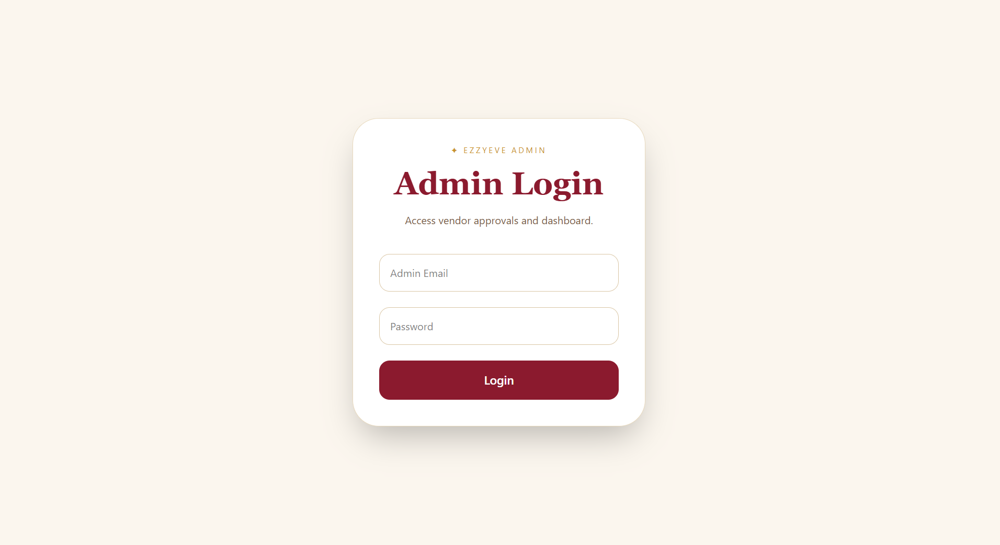

# EzzyEve

EzzyEve is a luxury event planning marketplace built using the MERN Stack.  
It connects customers with premium event vendors while providing a complete vendor approval and booking management system.

---

# 📑 Table of Contents

- [Overview](#overview)
- [Business Problem](#business-problem)
- [Dataset](#dataset)
- [Tools & Technologies](#tools--technologies)
- [Project Structure](#project-structure)
- [Data Cleaning & Preparation](#data-cleaning--preparation)
- [Exploratory Data Analysis (EDA)](#exploratory-data-analysis-eda)
- [Research Questions & Key Findings](#research-questions--key-findings)
- [Dashboard & Website Preview](#dashboard--website-preview)
- [How to Run This Project](#how-to-run-this-project)
- [Final Recommendations](#final-recommendations)
- [Author & Contact](#author--contact)

---

# Overview

EzzyEve is a modern event management and vendor marketplace platform designed to simplify event planning for users across India.

The platform allows users to:

- Browse luxury event vendors
- Filter vendors by city and category
- Register as a vendor
- Book event services
- Admin approval system for vendor verification
- Dynamic vendor listing from MongoDB database

This project follows a complete MERN Stack architecture using:

- MongoDB
- Express.js
- React.js
- Node.js

---

# Business Problem

Planning events in India often requires coordinating multiple vendors manually, which is time-consuming and inefficient.

Customers usually face problems like:

- Finding trusted vendors
- Comparing pricing
- Vendor authenticity
- Event budget management
- Lack of centralized event platforms

EzzyEve solves these problems by providing:

✅ Centralized vendor marketplace  
✅ Vendor verification system  
✅ Booking management system  
✅ Smart filtering and search  
✅ Premium event discovery experience  

---

# Dataset

The project uses dynamic vendor and booking data stored in MongoDB.

## Vendor Data Includes:

- Vendor Name
- Category
- City
- Pricing
- Description
- Rating
- Vendor Status

## Booking Data Includes:

- Customer Name
- Event Type
- Event Date
- Budget
- City
- Guest Count

---

# Tools & Technologies

| Technology | Purpose |
|---|---|
| React.js | Frontend Development |
| Tailwind CSS | UI Styling |
| Node.js | Backend Runtime |
| Express.js | REST API |
| MongoDB | Database |
| Mongoose | MongoDB ODM |
| Axios | API Requests |
| React Router DOM | Routing |
| Vite | Frontend Build Tool |
| Git & GitHub | Version Control |

---

# Project Structure

```bash
EzzyEve/
│
├── client/
│   ├── src/
│   │   ├── pages/
│   │   ├── components/
│   │   ├── App.jsx
│   │   └── main.jsx
│   │
│   └── package.json
│
├── server/
│   ├── models/
│   ├── routes/
│   ├── server.js
│   └── package.json
│
├── README.md
└── .gitignore
```

---

# Data Cleaning & Preparation

The platform ensures standardized and validated vendor data using:

- Dropdown-based category selection
- Fixed city options
- Price validation
- MongoDB schema validation
- Vendor approval workflow

This prevents inconsistent data entries and improves platform reliability.

---

# Exploratory Data Analysis (EDA)

The project analyzes:

- Vendor distribution across cities
- Category popularity
- Budget ranges
- Booking trends
- Vendor approval statistics

EDA helps improve marketplace recommendations and platform scalability.

---

# Research Questions & Key Findings

## Research Questions

1. Which cities have the highest vendor registrations?
2. Which event categories are most popular?
3. What budget range is most common among users?
4. How does vendor approval improve marketplace quality?
5. Which services receive the most bookings?

---

## Key Findings

✅ Wedding and luxury event vendors dominate the platform.

✅ Cities like Mumbai and Delhi show higher vendor activity.

✅ Vendor approval system significantly improves service quality.

✅ Most users search within mid-range event budgets.

✅ Photography and catering are among the most requested services.

---

# Dashboard & Website Preview

## Landing Page



---

## Services Page


---

## Vendor Registration



---

## Admin Dashboard



---

---

# How to Run This Project

## 1️⃣ Clone Repository

```bash
git clone https://github.com/yourusername/ezzyeve.git
```

---

## 2️⃣ Install Frontend Dependencies

```bash
cd client
npm install
```

---

## 3️⃣ Install Backend Dependencies

```bash
cd ../server
npm install
```

---

## 4️⃣ Start Backend Server

```bash
npm run dev
```

---

## 5️⃣ Start Frontend

Open another terminal:

```bash
cd client
npm run dev
```

---

## 6️⃣ Open Website

```bash
http://localhost:5173
```

---

# Final Recommendations

Future improvements for EzzyEve include:

- AI-based vendor recommendations
- Online payment integration
- Real-time chat system
- Vendor analytics dashboard
- Review and rating system
- Image upload support
- Email notifications
- Cloud deployment

These features can transform EzzyEve into a scalable production-ready event marketplace platform.

---

# Author & Contact

## 👨‍💻 Author

Mayank Olkha

---

## 📧 Contact

- Email: itsmrolkha1318@gmail.com
- GitHub: https://github.com/Mayankolkhaa
- LinkedIn: https://linkedin.com/in/Mayankolkhaa

---

# ⭐ If you like this project, give it a star on GitHub!